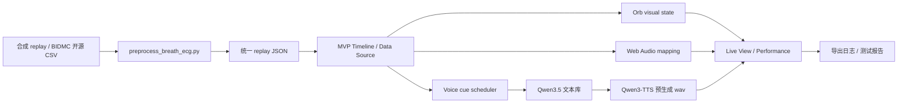

# 最终报告证据包索引

本文档用于快速整理 portfolio / final report 可以引用的证据。它不是替代 `docs/process-log.md`，而是把当前已完成的功能和对应文件集中列出。

## 当前状态

在没有学校/本人真实传感器数据的阶段，项目已经完成一个可演示的离线 replay 系统：

## 功能完成度

| 功能 | 状态 | 证据 |
| --- | --- | --- |
| 合成五分钟 replay | 已完成 | `mvp/data/replay/demo_replay.json` |
| 统一 replay schema | 已完成 | `scripts/data/preprocess_replay.py` |
| MVP replay / mock fallback | 已完成 | `mvp/src/main.js` |
| 生理 proxy 到视觉/声音/语音 | 已完成基础链路 | `mvp/src/main.js`、`mvp/server/index.js` |
| Qwen3.5 文本生成 | 已完成，关闭 thinking | `scripts/voice/pregenerate_voice_assets.py` |
| 高质量文本库 | 已完成 99 条 | `mvp/tts/precomputed/qwen35_quality_100/manifest_final_100.json` |
| Qwen3-TTS 音频库 | 已完成 99 条 | `mvp/tts/precomputed/manifest.json`、`mvp/tts/precomputed/audio/*.wav` |
| 中文测试语音库 | 已完成 99 条 | `mvp/tts/precomputed_zh/manifest.json`、`mvp/tts/precomputed_zh/audio/*.wav` |
| 开源真实数据预处理测试 | 已完成 BIDMC 120 秒 | `mvp/data/replay/bidmc_01_open_data_replay.json` |
| 合成 replay 端到端接口测试 | 已完成 | `artifacts/test-runs/synthetic_replay_precomputed_voice_e2e/测试报告.json` |
| 过程记录 | 已完成并持续更新 | `docs/process-log.md` |

## 关键测试结果

### 合成 replay 端到端

- 测试文件：`artifacts/test-runs/synthetic_replay_precomputed_voice_e2e/测试报告.json`
- replay 时长：300 秒
- frame 数：1501
- 阶段：calm、guidance、evaluation、overload、ending
- pressure 范围：0.0551 到 0.9602
- 五个阶段均能从 precomputed manifest 返回 Qwen3-TTS wav。
- 语音接口返回 `source: precomputed`，不触发慢速实时生成。

### Qwen3-TTS 语音库

- 文本来源：99 条均为 `qwen_generated`
- 音频数量：99 个 wav
- 采样率：全部 24000Hz
- 时长范围：1.85 到 5.29 秒
- 平均时长：3.077 秒
- audioErrors：0
- 输出：`mvp/tts/precomputed/manifest.json`

### 中文测试语音库

- 测试文件：`artifacts/test-runs/chinese_precomputed_voice_test/测试报告.json`
- 中文文本库：`mvp/tts/precomputed_zh/manifest_text_zh.json`
- 中文音频库：`mvp/tts/precomputed_zh/manifest.json`
- 文本来源：99 条均为 `manual_curated_translation`
- 翻译策略：保留睡眠助手的温柔、系统化和轻微控制感，避免医疗诊断、身体指令和数据播报。
- 音频数量：99 个 wav
- 采样率：全部 24000Hz
- 时长范围：1.29 到 5.21 秒
- 平均时长：3.195 秒
- audioErrors：0
- 接口测试：使用 `TTS_PRECOMPUTED_DIR=mvp/tts/precomputed_zh` 启动临时服务，五个阶段均返回中文文本和可访问的 `audio/wav`。

### BIDMC 开源数据预处理

- 数据来源：PhysioNet BIDMC PPG and Respiration Dataset v1.0.0
- 输入：`data/raw/physionet_bidmc/bidmc_01_Signals.csv`
- 输出：`mvp/data/replay/bidmc_01_open_data_replay.json`
- 截取时长：120 秒
- frame 数：601
- rPeakCount：730
- respPeakCount：158
- pressure 范围：0.1637 到 0.5239
- 校验：通过

## 可写入报告的核心论点

1. 离线 replay 不是逃避实时传感器，而是可靠性、伦理和表演概念共同决定的结构。
2. 合成数据用于搭建结构，开源数据用于验证真实噪声，学校/本人数据用于最终表演。
3. 所有生理指标都是艺术 proxy，不是医学诊断。
4. Qwen3.5 本机可用于高质量文本预生成，但 24GB 统一内存下实时速度有限。
5. Qwen3-TTS 本机可生成高质量语音，但适合预生成，不适合作为唯一低延迟现场方案。
6. 最终文本库经过 prompt 迭代、thinking mode 关闭、负面过滤、相似度过滤和人工复核，不是一次性生成结果。
7. 中文测试语音库采用人工策展翻译和重新 TTS 生成，适合中文报告、演示视频和本地测试。
8. 现场屏幕不显示 ECG 图表或数字，观众通过 orb、声音和语音感知身体数据影响。

## 仍需真实数据后完成

- 学校/本人呼吸 + ECG 离线采集。
- 将真实采集数据转换为 replay JSON。
- 对比合成 replay、开源 replay 和本人 replay 的表演差异。
- 录制最终 live view 表演视频。
- 收集一次观众反馈并记录调参。

## 外部来源

- PhysioNet BIDMC PPG and Respiration Dataset v1.0.0：https://physionet.org/content/bidmc/1.0.0/
- Qwen 文档：https://qwen.readthedocs.io/en/v3.0/getting_started/quickstart.html
- Qwen Transformers 推理文档：https://qwen.readthedocs.io/en/stable/inference/transformers.html
- Ollama thinking 文档：https://docs.ollama.com/capabilities/thinking
